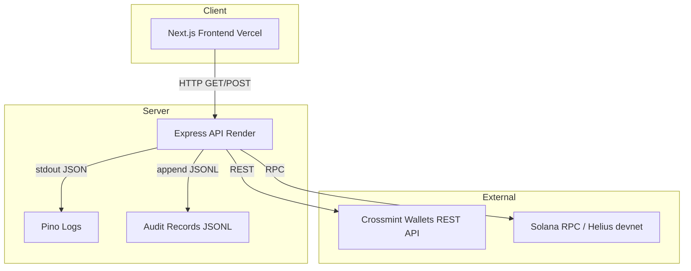
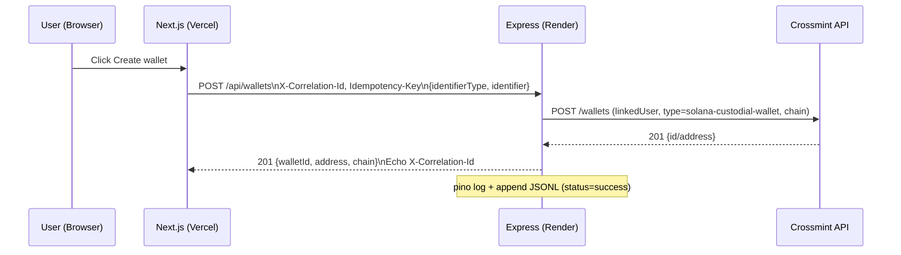
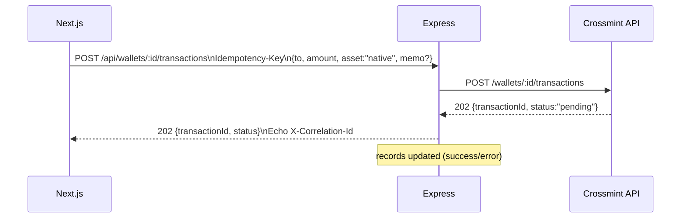

# Architecture

## System diagram

## Create wallet (sequence)

## Transfer (native SOL)

## Error model, headers, and idempotency
- Error shape: `{ code, message, details?, correlationId }`
- Correlation ID: client may provide `X-Correlation-Id`; server generates if absent; always echoed back.
- Idempotency: POST routes accept `Idempotency-Key`; duplicates return a non-fatal conflict with metadata.

## Security & CORS
- Secrets stay server-side (`CROSSMINT_API_KEY`). Frontend uses `NEXT_PUBLIC_*` only.
- CORS allowlist: localhost (dev) and Vercel domains (prod/preview).
- (Planned) Rate limiting on POST and ADMIN_TOKEN guard for `/admin/records`.

## Logging & records
- Logs: pino JSON to stdout (and optionally file), include route, correlationId, outcome, durationMs.
- Records: append to `server/records/operations.jsonl` (ts, correlationId, operation, request/response summaries, status).
- (Planned) Dev-only `/admin/records?limit=50` for remote viewing.

## Environments & deployment
- Backend: Render Web Service, Node 20+, Health `/health`, Build `pnpm install && pnpm run build`, Start `pnpm start`.
- Frontend: Vercel, `NEXT_PUBLIC_BACKEND_URL` points to Render service.
- Warmth: UptimeRobot GET `/health` every 5 minutes to reduce cold starts.

## Extensibility
- Helius RPC via `SOLANA_RPC_URL` and devnet airdrop button for demo flow.
- SPL token balance/transfer support (e.g., devnet USDC) via asset selector.
- Sentry FE/BE, remote logs provider, CI with typecheck/lint/build, and integration tests.

## Related docs
- `server/API_CONTRACT.md` — precise routes, request/response shapes, headers.
- `BACKEND_STATUS.md` — current state and next steps.
- `BACKEND_WALLETS_REFERENCE.md` — operator/developer reference.
