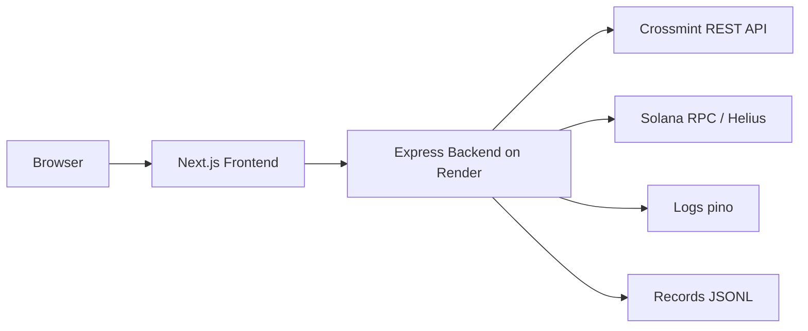

<div align="center">
  <h1>WZRD Wallets Demo</h1>
  <p>Next.js + Node/Express REST backend for Solana wallets via Crossmint. Server‑centric, with logging + audit records. Deployed on Vercel + Render.</p>
</div>

## Live links
- Frontend (Vercel): `https://wallets-quickstart-wine.vercel.app/`
- Backend health (Render): `https://wallets-quickstart.onrender.com/health`

## What I built
- Node/Express backend that adapts to Crossmint Wallets REST on Solana (create/get/balance/activity/transfer).
- Correlation‑ID on all responses, idempotency for POSTs, and JSONL audit records written on each action.
- Next.js frontend page `/backend-demo` that exercises the server API and displays JSON, status, and correlation IDs.
- Split deployment: frontend (Vercel), backend (Render) with CORS allowlist.

## Tech stack
- Frontend: Next.js, React, TypeScript, Tailwind (Vercel)
- Backend: Node.js, Express, axios, zod, pino, dotenv (Render)
- Web3: Crossmint Wallets REST (staging), Solana devnet (optional Helius)
- Observability: pino structured logs, JSONL audit records

## Architecture (thumbnail)



For a deeper dive (sequence diagrams, error model, security, deployment), see `ARCHITECTURE.md` and `server/API_CONTRACT.md`.

## Quickstart

### Backend (Render locally)
```bash
cd server
cp .env.example .env
# Fill envs:
# CROSSMINT_API_KEY=...
# CROSSMINT_BASE_URL=https://staging.crossmint.com/api/2022-06-09
# CHAIN=solana
# LOG_LEVEL=info
# CORS_ORIGINS=http://localhost:3000
pnpm install
pnpm dev
# health: http://localhost:4000/health
```

### Frontend
```bash
# from repo root
cp .env.template .env.local
# Set:
# NEXT_PUBLIC_BACKEND_URL=http://localhost:4000
# NEXT_PUBLIC_CHAIN=solana
pnpm install
pnpm dev
# open http://localhost:3000/backend-demo
```

## Deploy

### Backend (Render)
- Root Directory: `server`
- Build: `pnpm install --frozen-lockfile && pnpm run build`
- Start: `pnpm start`
- Health Path: `/health`
- Env: `CROSSMINT_API_KEY`, `CROSSMINT_BASE_URL`, `CHAIN=solana`, `LOG_LEVEL=info`, `CORS_ORIGINS=https://<your-vercel-domain>`

### Frontend (Vercel)
- Env: `NEXT_PUBLIC_BACKEND_URL=https://wallets-quickstart.onrender.com`, `NEXT_PUBLIC_CHAIN=solana`
- Redeploy production after backend is live.

## Test the API (curl)
```bash
BACKEND=https://wallets-quickstart.onrender.com

# Create wallet
curl -X POST $BACKEND/api/wallets \
  -H "Content-Type: application/json" \
  -H "X-Correlation-Id: test-$(date +%s)" \
  -H "Idempotency-Key: $(uuidgen)" \
  -d '{"identifierType":"email","identifier":"me+demo@gmail.com"}'

# Health
curl $BACKEND/health
```

## Roadmap (selected)
- UI polish on `/backend-demo` (loaders, toasts, Copy cURL, status chips, elapsed ms)
- Admin `/admin/records` endpoint + viewer (guarded by ADMIN_TOKEN)
- Helius RPC + airdrop button; SPL token support (e.g., devnet USDC)
- Sentry FE/BE; remote logs; rate limiting; CI; tests; Postman collection

## License & attribution
- Based on the Crossmint quickstart. See `LICENSE` and `README` history for attribution.


